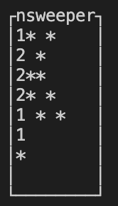

# NSWEEPER  

This is minesweeper in the terminal, built with c++ and ncurses.

### Instructions to Play
* Use the arrow keys on your keyboard to move the selection cursor around
* Press enter to uncover a square
* Press F to flag a sqaure

## Installation

### Prerequisutes
1. Docker
2. VSCode
3. VSCode Extensions: Docker, Remote-Container

### Getting Started
1. Clone Repo with `git clone --recursive https://github.com/gadirajup/nsweeper.git`
2. Open in VSCode -> Reopen in Container
3. run `mkdir build && cd build`
4. run `cmake ..`
5. run `make`
6. run `./src/nsweeper` to play
